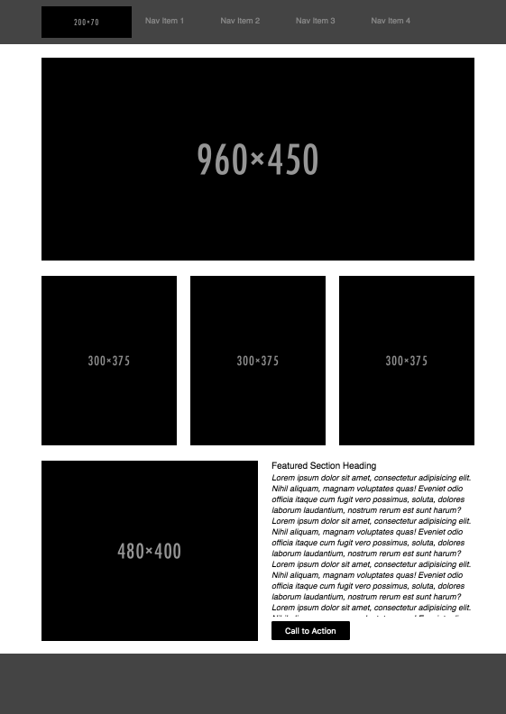
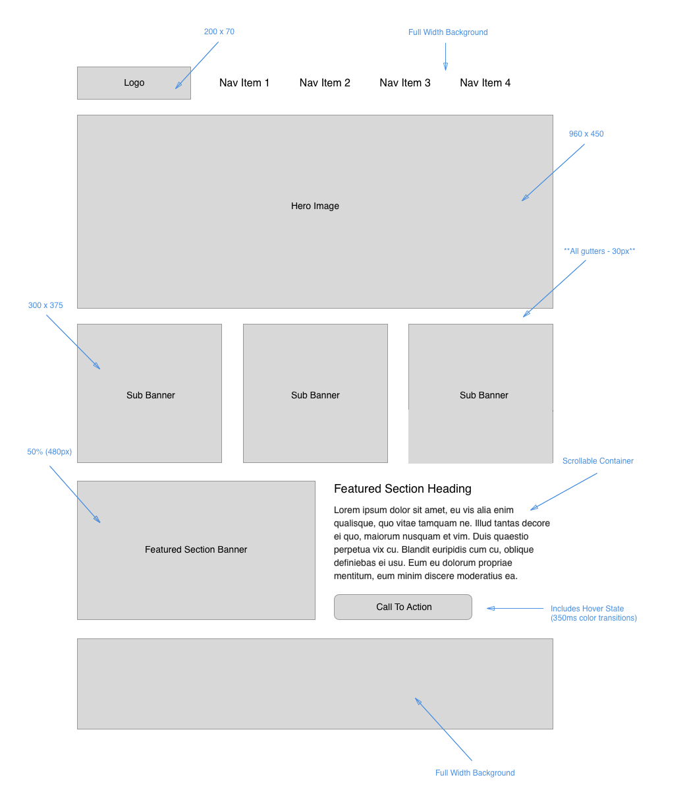

# HTML/CSS Wireframe Exercise

Read the document, in its entirety, before beginning your lab. To view this lab assignment in its own tab, click [here](https://codefellows.github.io/code-201-guide/curriculum/class-08/lab-a/){:target="_blank"}

## Problem Domain

Today, you will practice building out a professional-style wireframe document from a provided spec. You are only allowed to use HTML and CSS. No additional frameworks or libraries can be utilized.

Here is the wireframe you will be building out. You may find a larger version of this image in your daily class repo for the respective class day.

Here is the annotated version with a few more details:

Professional wireframes are supposed to keep the presentation of the site simple without any additional content. The whole point of a wireframe is to get the layout figured out, while the real content can get added in the future. Wireframes allow the client to drive what layouts they like and what they don't like. Wireframes traditionally only contain:

1. Placeholder images
1. Filler text such as [lorem ipsum](https://lipsum.com/){:target="_blank"}

Placeholder images are a great resource inside a wireframe because they are simply placeholders with a size dependent on whatever the url is that you specified. Example: `` produces the following image, with a width of 200 pixels, a height, of 300 pixels, and color of `#DDD`, which is a light gray:

Avoid using real images, as it can take away from the layout or theme of the wireframe. It can serve as a distraction to the client during the collaboration and construction of the wireframe.

## Instructions

Create a new repo titled 'wirefame-exercise', making sure to configure it with `index.html`, `style.css`, and `reset.css` (use [Eric Meyer's reset](https://meyerweb.com/eric/tools/css/reset){:target="_blank"}).

Consider taking a more professional approach to web development by planning out your approach before jumping into code.

1. Have a design concept and a plan completely ready to go before you write the first line of code.
    - Build/Review a wireframe showing all document dimensions
    - Know where images will go and how big they will be
    - Use placeholder images during the setup process
    - Know where text will go and use placeholder *lorem ipsum* text
1. Set up the project repository, scaffold the files, and make sure they are wired together.
1. Build out all of the HTML without applying any classes or IDs
1. Working top to bottom in the document, put elements into place with CSS, using the structure of the HTML to create selectors wherever it is possible. Seek to limit use of classes and IDs to only where they are needed.
1. Apply color, backgrounds, borders, text styling, etc., to the specifications of the design.

After each step, be sure to "ACP" within your git work-flow.

With this wireframe in place, you can now present it to the designer and/or client for review, make any requested edits, and once there is a signoff on the wireframe, then it is time to start entering the actual content.

## Resources

Look in today's GitHub daily class repo directory for a larger version of the wireframe and annotated wireframe.

## Submission Instructions

Your instructional team will grade your assignment, and give you feedback.

1. Submit the link to your repo for this project's work
1. Add a comment to this submission with answers to the following questions.
    - How did this go, overall?
    - What observations or questions do you have about what you've learned so far?
    - How long did it take you to complete this assignment? And, before you started, how long did you think it would take you to complete this assignment?